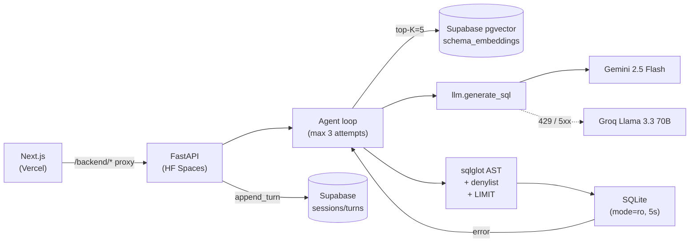

# Querymancer

**Conversational analytics over multi-schema databases.** Ask a database in plain English, get SQL, results, and visualisations back — with retrieval-augmented schema context, an agentic self-correction loop, a production-grade safety pipeline so generated SQL never touches anything it shouldn't, and a Gemini-primary / Groq-fallback LLM strategy that keeps the system answering even when free-tier quotas blow up.

**Live demo:** [querymancer.vercel.app](https://querymancer.vercel.app)
**Backend:** [asinghby-querymancer-backend.hf.space](https://asinghby-querymancer-backend.hf.space)


## What it does

You type *"which 5 products generated the most revenue last quarter?"* against one of the bundled databases. Querymancer:

1. **Retrieves** the relevant table and column descriptions for your question via vector search over schema embeddings (RAG, top-K=5).
2. **Generates** SQL with an LLM, returning a structured response that includes the query, an explanation, and a suggested chart type. Falls back from Gemini to Groq automatically when free-tier quota is exhausted.
3. **Validates** the SQL through a multi-layer safety gate (sqlglot AST parse → keyword denylist → single-statement check → auto-`LIMIT` injection).
4. **Executes** it against a read-only SQLite connection with a 5-second timeout and a 1000-row cap.
5. **Self-corrects** if execution fails — the verbatim DB error is fed back into the next prompt attempt, up to 3 retries. The frontend renders this live via a streaming NDJSON endpoint.
6. **Renders** results as a table plus an auto-selected chart (bar, line, pie, scalar) — whichever matches the result shape.

Multi-turn refinement is built in: ask a follow-up like *"now break it down by category"* and the system resolves it against the prior turns from the same session.

## Architecture



Full diagrams, the /query sequence with the fallback decision, the safety pipeline, the multi-turn design, and the module map live in [`docs/architecture.md`](docs/architecture.md).

## Tech stack

| Layer | Choice |
|---|---|
| LLM (primary) | Google Gemini 2.5 Flash, structured output via `response_schema` |
| LLM (fallback) | Groq Llama 3.3 70B, JSON mode, fires only on Gemini 429 / 5xx |
| Embeddings | `gemini-embedding-001` (768 dims, MRL renormalised, asymmetric task_type) |
| Vector store | Supabase Postgres + `pgvector` 0.8.0 (HNSW cosine index) |
| Sessions | Supabase Postgres tables (`sessions`, `turns`) |
| Sample databases | SQLite, bundled in the Docker image, opened `mode=ro` |
| SQL safety | `sqlglot` AST validation + keyword denylist + single-statement enforcement |
| Backend | FastAPI (Python 3.11) on Hugging Face Spaces (Docker SDK, CPU basic) |
| Frontend | Next.js 16 (App Router) + React 19 + Tailwind v4 + Framer Motion |
| ERD / schema viz | React Flow + dagre |
| Charts | Recharts |
| Frontend hosting | Vercel Hobby (GitHub auto-deploy) |
| CI | GitHub Actions (backend tests, frontend build, HF Space keepalive) |

Every component is on a permanent free tier — no credit card required.

## Sample databases

Three pre-loaded demo databases ship in the backend image, all opened read-only:

| DB | Tables | Rows | Domain |
|---|---|---|---|
| `northwind` | 13 | ~3K | classic e-commerce — customers, orders, products, suppliers |
| `hr` | 7 | ~1.7K | HR analytics — employees, departments, salaries, performance |
| `ipl` | 8 | ~16.8K | IPL cricket — matches, deliveries, players, teams, venues |

Switch DBs from the sidebar in the UI. Each switch resets the conversation (sessions are bound to one schema).

## Screenshots

| | |
|---|---|
|  |  |
| Schema browser — collapsible table list with FK links | Interactive ERD — click a table to focus its joins |
|  |  |
| Mobile layout — full feature parity below `md` | Curated starter questions per DB |

## Local setup

Backend (Python 3.11):

```bash
cd backend
python -m venv .venv && .venv/Scripts/activate     # Windows
# python -m venv .venv && source .venv/bin/activate  # POSIX
pip install -e ".[dev]"
cp .env.example .env                                # then fill in GEMINI_API_KEY,
                                                    # SUPABASE_DB_URL, optionally GROQ_API_KEY
python -m uvicorn app.main:app --reload
```

Frontend (Node 20):

```bash
cd frontend
npm ci
BACKEND_URL=http://127.0.0.1:8000 npm run dev
# open http://localhost:3000
```

Index a new SQLite database into pgvector:

```bash
cd backend
python -m cli.reindex --db-id <id> --sqlite-path databases/<file>.db
```

Run the unit suite (no live LLM / Supabase calls — `conftest.py` stubs both):

```bash
cd backend
pytest -q
```

Run the eval suite against a live backend (writes a dated markdown report under `eval/reports/`):

```bash
python eval/run_eval.py --backend http://127.0.0.1:8000 --concurrency 2
# subset filters: --only-db hr, --only-difficulty hard, --limit-per-db 10
```

## Eval status

The eval harness (`eval/run_eval.py`) grades 150 cases across the 3 sample DBs by row-count assertion and writes a dated markdown report with pass rate, per-DB and per-difficulty breakdowns, latency p50/p95/p99, and failure modes grouped (`UPSTREAM_LLM`, `ASSERTION_FAILED`, `SQL_INVALID`, `TIMEOUT`).

Baseline numbers are being collected across multiple days because the combined free-tier budget (Gemini 20 RPD + Groq 100K TPD ≈ 40-50 successful cases/day with our prompt size) doesn't fit 150 cases in one session. The final aggregate report will land at `eval/reports/` once HR and IPL slices complete.

## Roadmap

- [x] Phase 0 — repo scaffolding, accounts, plan
- [x] Phase 1 — core SQL generation (FastAPI + Gemini 2.5 Flash, structured output)
- [x] Phase 2 — safety gate + read-only executor + self-correction loop
- [x] Phase 3 — schema RAG over Supabase pgvector
- [x] Phase 4 — Next.js frontend (chat, schema browser, interactive ERD, mobile)
- [x] Phase 5 — multi-turn sessions + live "self-correcting…" UX + landing page
- [x] Phase 6 — deployment (HF Spaces + Vercel) + GitHub Actions CI + Groq fallback
- [ ] Phase 7 — eval baseline (in progress, paced across multiple days due to free-tier quotas), demo video

## License

MIT.
