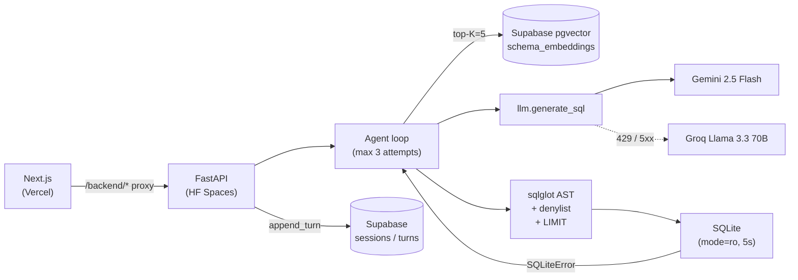

<div align="center">

# Querymancer

### Conversational analytics over multi-schema databases

**Ask a database in plain English. Get safe SQL, live results, and the right chart back — with retrieval-augmented schema context, an agentic self-correction loop, and a Gemini-primary / Groq-fallback LLM strategy that keeps the system answering through free-tier quota walls.**

<p>
  <a href="https://querymancer.vercel.app"></a>
  <a href="https://asinghby-querymancer-backend.hf.space/docs"></a>
  <a href="docs/architecture.md"></a>
</p>

<p>
  
  
  
  
  
</p>

<br/>


</div>

<br/>

## Highlights

|  |  |  |
|---|---|---|
| **RAG over schema** | **Agentic self-correction** | **Defense-in-depth safety** |
| Top-K pgvector retrieval surfaces only the tables that matter, so 13-table databases don't blow the prompt window. Asymmetric `task_type` (DOCUMENT vs QUERY) and 768-d MRL-renormalised vectors. | When generated SQL fails to execute, the verbatim DB error is fed back into the next attempt (max 3). Most failures fix themselves on attempt 2 — streamed live to the frontend as it happens. | Two independent layers: `sqlglot` AST + denylist + single-statement + auto-`LIMIT`, *and* the connection itself opens `mode=ro`. Layer 1 can't be bypassed by stacked-statement or comment-injection tricks. |
| **Gemini → Groq fallback** | **Multi-turn refinement** | **Production-grade eval** |
| When Gemini's free-tier daily cap hits, `llm.generate_sql` automatically retries the same prompt against Groq Llama 3.3 70B. The demo stays live on quota days. | Sessions persist to Supabase; the last 2 turns get inlined into the prompt. Ask *"now break that down by category"* and the model resolves the pronoun against the previous SQL. | 150-case async eval harness grades by row-count assertion across 3 DBs and 3 difficulty tiers. Writes dated markdown reports incrementally — Ctrl-C leaves a valid partial. |

<br/>

## Architecture



The full component diagram, the `/query` sequence with the fallback decision branch, the safety-pipeline detail, the RAG chunk format, the multi-turn design, the streaming-endpoint protocol, and the module map all live in **[`docs/architecture.md`](docs/architecture.md)**.

<br/>

## Tech stack

<p><b>LLM &amp; vectors</b></p>
<p>
  
  
  
  
</p>

<p><b>Backend</b></p>
<p>
  
  
  
  
  
  
</p>

<p><b>Frontend</b></p>
<p>
  
  
  
  
  
  
  
</p>

<p><b>Infra &amp; CI</b></p>
<p>
  
  
  
  
</p>

Every component is on a permanent free tier. Zero-dollar budget was a hard constraint, not a stretch goal.

<br/>

## Sample databases

Three pre-loaded demo databases ship in the backend image, all opened read-only:

| DB | Tables | Rows | Domain |
|---|---|---|---|
| `northwind` | 13 | ~3K | classic e-commerce — customers, orders, products, suppliers |
| `hr` | 7 | ~1.7K | HR analytics — employees, departments, salaries, performance |
| `ipl` | 8 | ~16.8K | IPL cricket — matches, deliveries, players, teams, venues |

Switch DBs from the sidebar. Each switch resets the conversation — sessions are bound to one schema.

<br/>

## In the UI

<table>
  <tr>
    <td></td>
    <td></td>
  </tr>
  <tr>
    <td align="center"><sub><b>Interactive ERD</b> — React Flow + dagre. Click a table to focus its joins; click a column to insert <code>Table.column</code> into the prompt.</sub></td>
    <td align="center"><sub><b>Schema browser</b> — collapsible per-table view with PK / FK highlighting and "REFERENCED BY" sections.</sub></td>
  </tr>
  <tr>
    <td></td>
    <td></td>
  </tr>
  <tr>
    <td align="center"><sub><b>Curated starters</b> — 8 hand-tuned questions per DB to seed exploration.</sub></td>
    <td align="center"><sub><b>Mobile-native</b> — slide-in drawer, full feature parity below the <code>md</code> breakpoint.</sub></td>
  </tr>
</table>

<br/>

## Quickstart

```bash
# 1. clone and enter backend
git clone https://github.com/AryamannSingh7/querymancer.git
cd querymancer/backend

# 2. python deps + env
python -m venv .venv && .venv/Scripts/activate    # Windows
# python -m venv .venv && source .venv/bin/activate   # POSIX
pip install -e ".[dev]"
cp .env.example .env    # then fill GEMINI_API_KEY, SUPABASE_DB_URL, optionally GROQ_API_KEY

# 3. run backend
python -m uvicorn app.main:app --reload
```

```bash
# 4. frontend in another terminal
cd ../frontend
npm ci
BACKEND_URL=http://127.0.0.1:8000 npm run dev
# open http://localhost:3000
```

<details>
<summary><b>Other useful commands</b></summary>

```bash
# index a new SQLite DB into pgvector
cd backend && python -m cli.reindex --db-id <id> --sqlite-path databases/<file>.db

# unit tests (no live LLM / Supabase — conftest stubs both)
cd backend && pytest -q

# eval against a running backend
python eval/run_eval.py --backend http://127.0.0.1:8000 --concurrency 2
# subset filters:
#   --only-db hr            --only-difficulty hard            --limit-per-db 10
```

</details>

<br/>

## Eval

The eval harness (`eval/run_eval.py`) grades 150 cases across 3 DBs and 3 difficulty tiers by row-count assertion. Each report includes:

- pass rate (overall, per-DB, per-difficulty)
- latency `p50` / `p95` / `p99` (client-side, what users feel)
- attempt distribution — how often the self-correction loop kicks in
- failure modes grouped (`UPSTREAM_LLM`, `ASSERTION_FAILED`, `SQL_INVALID`, `TIMEOUT`)
- delta vs previous run

Reports are written incrementally — Ctrl-C leaves a valid partial behind.

> **Baseline status:** numbers are being collected across multiple days. The combined free-tier budget (Gemini 20 RPD + Groq 100K TPD) fits roughly 40-50 successful cases per day at our prompt size — the full 150-case aggregate will land at `eval/reports/` once the HR and IPL slices complete.

<br/>

## Roadmap

| Phase | Scope | Status |
|---|---|---|
| 0 | Repo scaffolding, accounts, plan | shipped |
| 1 | Core SQL generation — FastAPI + Gemini 2.5 Flash, structured output | shipped |
| 2 | Safety gate + read-only executor + self-correction loop | shipped |
| 3 | Schema RAG over Supabase pgvector | shipped |
| 4 | Next.js frontend — chat, schema browser, interactive ERD, mobile | shipped |
| 5 | Multi-turn sessions + live "self-correcting…" UX + landing page | shipped |
| 6 | Deployment (HF Spaces + Vercel) + GitHub Actions CI + Groq fallback | shipped |
| 7 | Eval baseline (in progress, paced across multiple days for free-tier quotas), demo video | in progress |

<br/>

## License

MIT.

<br/>

<div align="center">
  <sub>Built by <a href="https://github.com/AryamannSingh7">@AryamannSingh7</a> · <a href="https://querymancer.vercel.app">querymancer.vercel.app</a></sub>
</div>
