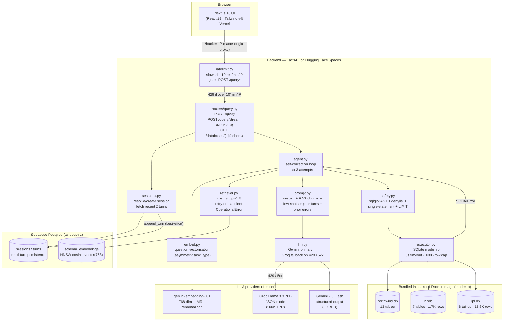
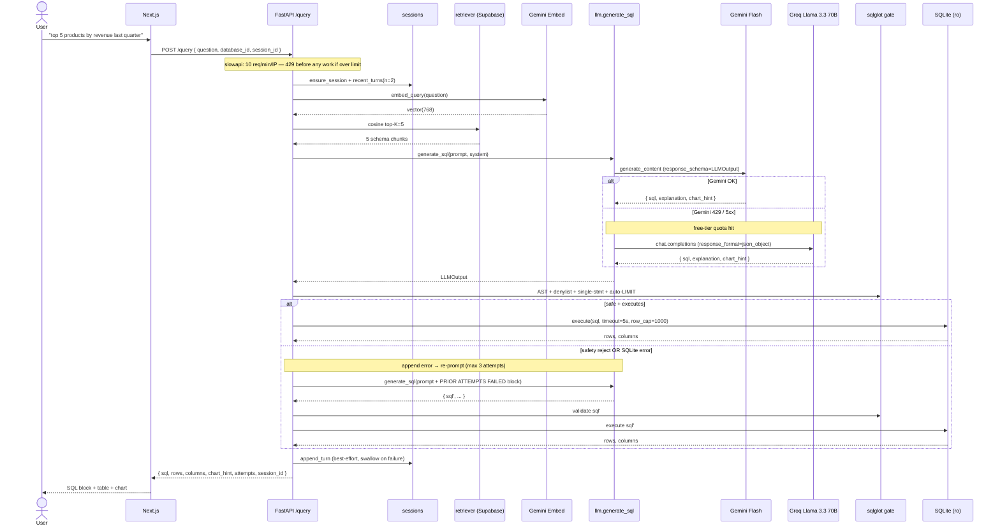

# Querymancer — Architecture

This document describes what's actually deployed today. The high-level
intent and decision rationale live in the plan file; this file tracks
the shipped system.

## 1. Component diagram



## 2. /query sequence (happy path + self-correction + fallback)



## 3. LLM provider fallback policy

`app/core/llm.py:generate_sql` tries Gemini first. Falls back to Groq
only when:

- `ClientError(code=429)` — Gemini free-tier daily quota exhausted, or
- `ServerError` — any 5xx from Gemini.

Any other error (400 — malformed prompt, 401 — bad key) re-raises
without trying Groq. A malformed prompt is a bug we want surfaced, not
silently re-prompted against a second provider.

When `groq_api_key` is empty the fallback is a no-op — behaviour
matches the pre-fallback code path. This keeps local dev safe for
contributors who only have a Gemini key.

If both providers fail, the original Gemini exception is re-raised
with the Groq exception chained as `__cause__`. The router renders the
existing 503/502 UX unchanged — adding a new exception class would
force every caller to learn about the dual-provider design.

## 4. Safety pipeline (defense in depth)

Two independent layers, both required for any LLM-generated SQL:

| Layer | Mechanism | Bypassable? |
|---|---|---|
| 1. `safety.is_safe()` | sqlglot parses the SQL into an AST. Reject if the root isn't `SELECT` / `CTE`. Reject if any node matches the denylist (`DROP`, `DELETE`, `INSERT`, `UPDATE`, `ATTACH`, `PRAGMA`, `CREATE`, `ALTER`, `REPLACE`, `TRUNCATE`). Reject if more than one statement. Auto-append `LIMIT 100` if the LLM forgot. | No — the AST sees through stacked-statement and comment-injection tricks. |
| 2. `executor.run_sql()` | Opens the SQLite file with `?mode=ro&immutable=1` URI flag. 5-second statement timeout. 1000-row cap on the cursor. | No — even if layer 1 was bypassed, the connection itself cannot mutate. |

Both layers are non-negotiable per CLAUDE.md. Removing either would
make Querymancer unsafe to expose publicly.

A third, coarser layer guards the *service* rather than the SQL.
`app/core/ratelimit.py` applies a per-IP `slowapi` limit of **10
requests/minute** to `POST /query` and `POST /query/stream` (the
decorator runs before any session, retrieval, or LLM work). The client
IP is read from the `X-Forwarded-For` header — HF Spaces fronts the
container with a pool of internal router pods, so `request.client.host`
is a rotating proxy address that would defeat the limiter if keyed on
directly. The public
demo runs on a free-tier Gemini key capped at 20 requests/day — without
the limiter a single client refreshing the page could drain the whole
day's budget in seconds. The 11th request in a window gets a `429` with
the structured `{detail:{message,attempts,errors}}` body and a
`Retry-After: 60` header; `lib/api.ts` maps it to the same "try again"
UX as an upstream-quota 503. Storage is in-memory fixed-window — no
Redis, correct for the single Space instance. The limiter is disabled
in the test suite via an autouse fixture and exercised by one dedicated
test (`test_query_rate_limited`). The eval harness retries `429`s the
same way it retries `503`s, so a rate-limited slice self-recovers.

## 5. Schema RAG

Per-table chunks are pre-computed by `cli/reindex.py`:

```
TABLE: Customers
DESCRIPTION: <1-line summary, generated by Gemini Flash-Lite>
COLUMNS:
  - CustomerID TEXT PRIMARY KEY
  - CompanyName TEXT
  - Country TEXT
SAMPLE_VALUES:
  Country: ['Germany', 'USA', 'UK']
RELATIONSHIPS:
  - referenced by Orders (FK on CustomerID)
```

The chunk text is embedded with `gemini-embedding-001` at 768 dims
(MRL truncation, L2-renormalised so cosine becomes dot-product on the
unit hypersphere). Stored in Supabase Postgres with an HNSW cosine
index. Asymmetric `task_type` is used:
`RETRIEVAL_DOCUMENT` at index time, `RETRIEVAL_QUERY` at query time.

Idempotent — re-running `reindex` on unchanged input is a no-op via
the `content_hash` column.

## 6. Multi-turn

The router fetches the last 2 turns from `turns` and inlines them as a
`PRIOR TURNS` block in the prompt (newest last). Sessions are bound to
a single `database_id`; the frontend resets `session_id` and the local
turns list when the user switches DB — inlining prior turns from a
different schema would just confuse the model.

After 5 turns the older turns can be summarised into a 1-line context
string (planned, not yet shipped).

## 7. Streaming endpoint

`POST /query/stream` emits NDJSON events as the agent loop progresses:

```
{"event":"attempt_started","attempt":1}
{"event":"attempt_failed","attempt":1,"reason":"safety: ..."}
{"event":"attempt_started","attempt":2}
{"event":"result","session_id":"...","sql":"...","rows":[...]}
```

Used by the frontend to render a live "self-correcting… attempt N of
3" status. Terminal failures (unknown DB, agent exhausted, upstream
LLM error) emit a single `error` event and close the stream cleanly
— the HTTP status stays 200 because the response body has already
begun. The frontend distinguishes outcomes by `event.kind`.

## 8. Module map

```
backend/
  app/
    main.py              # FastAPI app, CORS, rate limiter + exception handlers
    models.py            # QueryRequest, QueryResponse, LLMOutput, ChartHint
    routers/
      query.py           # POST /query, POST /query/stream (both rate-limited)
      schema.py          # GET /databases/{id}/schema
    core/
      config.py          # Settings via pydantic-settings + .env
      embed.py           # Gemini embed (asymmetric task_type)
      retriever.py       # cosine top-K against pgvector
      prompt.py          # system + RAG + few-shots + prior turns + errors
      llm.py             # Gemini primary, Groq fallback on 429 / 5xx
      safety.py          # sqlglot AST + denylist + single-stmt + LIMIT
      ratelimit.py       # slowapi per-IP limiter (10/min) + 429 handler
      executor.py        # SQLite mode=ro, 5s timeout, 1000-row cap
      agent.py           # self-correction loop, max 3 attempts (sync + iter)
      sessions.py        # sessions/turns persistence (Supabase, retry-on-OperationalError)
      introspect.py      # introspect_sqlite() for /schema route
  cli/
    reindex.py           # one-shot schema indexer (SQLite → Supabase pgvector)
  databases/
    northwind.db hr.db ipl.db  # bundled, mode=ro
  scripts/
    seed_supabase.sql    # extensions, tables, RLS, HNSW index
    smoke_*.py           # end-to-end + per-component smoke checks
  tests/                 # pytest, conftest stubs retriever + sessions

frontend/
  app/                   # Next.js App Router
    layout.tsx page.tsx globals.css
  components/
    QuerymancerApp.tsx   # top-level client, holds session + turns
    Sidebar.tsx          # DB selector + Try / Schema tabs
    SchemaBrowser.tsx    # collapsible table list
    SchemaDiagram.tsx    # React Flow ERD with click-to-insert
    ChatPanel.tsx        # message list + composer
    ResultsPanel.tsx     # Chart / Table tabs
    ChartRenderer.tsx    # recharts dispatch on chart_hint
    SqlBlock.tsx         # syntax-highlighted SQL
  lib/
    api.ts types.ts suggestedQuestions.ts
  next.config.ts         # /backend/* → BACKEND_URL rewrite (same-origin)
  playwright.config.ts   # e2e config — video:'on', deployed app by default
  e2e/
    demo.spec.ts         # scripted walkthrough → recorded demo + §17 smoke test

eval/
  cases.yaml             # 150 cases × 3 DBs
  run_eval.py            # async harness, incremental writes (retries 429 + 503)
  reports/               # dated markdown reports
```
